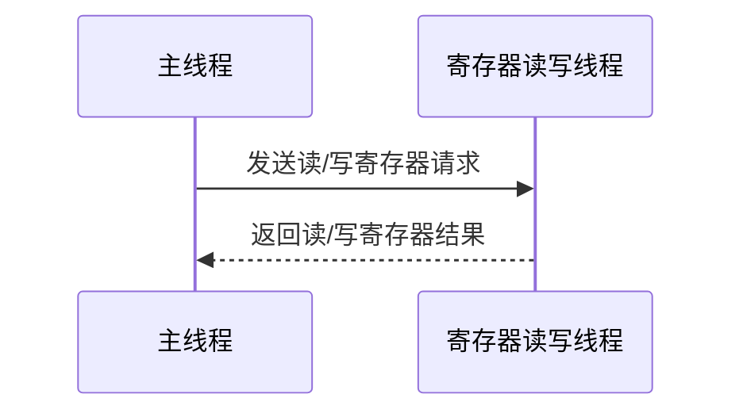

# M1 ISPTuningTool

## 编码规范

### 命名规则

> 命名规则参照[Qt 官方编码风格指南](https://wiki.qt.io/Qt_Coding_Style)。

## 流程图

- 初始化
```plantuml
start
:用户认证（后续讨论）;
:打开默认界面;
:加载配置;
:点击Connect;
:检查I2C/SPI是否连通;
:加载数据库;
:开启寄存器读写线程（存疑）;
end
```

- 读写寄存器(考虑写寄存器操作跟生效实时？)


## 类设计

### 寄存器读写

+ 采用单例实现
指定读写寄存器的SalveID, Address Length, Value Length, Address等

```plantuml
class QUsbCommunication
{
    - int usbType  //指定使用I2C读写还是SPI读写,0:I2c,1:Spi
     + initUsb()    //初始化，指定usbType
    + checkState()  //检查I2C/SPI是否连通
    + readBurst()
    + wtiteBurst()

    - checkI2cState()
    - checkSpiState()
    - readI2cBurst()
    - readSpiBurst()
    - wtiteI2cBurst()
    - wtiteSpiBurst()
}
```

### 数据库相关

#### DataBaseOrm

##### struct

###### 1. Permission (权限结构体)

```c++
struct Permission {
    std::string permissionName;  // 权限名称，作为主键
};
```

**作用**：表示系统中的权限项
**字段说明**：

- `permissionName`: 唯一标识一个权限的字符串

对应数据库`permission`的内容

###### 2. Register (寄存器结构体)

```c++
struct Register {
    uint32_t    address;               // 寄存器地址，作为主键
    std::string displayName;           // 显示名称
    std::string rwInfo;                // 读写权限信息
    int         defaultValue;          // 默认值
    std::string registerDescription;   // 寄存器描述
    std::string permissionName;        // 关联的权限名称(外键)
};
```

**作用**：描述硬件寄存器的基础信息
**字段说明**：

- `address`: 寄存器的物理地址(16进制)
- `displayName`: 用于UI显示的寄存器名称
- `rwInfo`: 读写权限，如"RO"(只读)、"RW"(读写)等
- `defaultValue`: 寄存器的默认值
- `permissionName`: 关联到Permission表的外键

对应数据库`register`中的内容

###### 3. Module (模块结构体)

```c++
struct Module {
    std::string moduleName;            // 模块名称，作为主键
    std::string moduleDescription;     // 模块描述
    std::string permissionName;        // 关联的权限名称(外键)
};
```

**作用**：表示硬件或功能模块
**字段说明**：

- `moduleName`: 模块的唯一标识
- `moduleDescription`: 模块的功能描述
- `permissionName`: 控制访问该模块所需的权限

对应数据库`Module`中的内容

###### 4. CombinedRegister (组合寄存器结构体)

```c++
struct CombinedRegister {
    int                  combinedId;       // 组合ID，自增主键
    std::string          moduleName;       // 所属模块名称(外键)
    std::shared_ptr<int> cameraId;         // 关联的相机ID(可为空)
    std::string          combinedName;     // 组合名称
    std::string          displayName;      // 显示名称
    std::string          combinedDescription; // 组合描述
    std::string          permissionName;   // 关联的权限名称(外键)
};
```

**作用**：将多个寄存器位组合成一个逻辑单元
**字段说明**：

- `combinedId`: 自动生成的唯一ID
- `moduleName`: 关联的模块名称
- `cameraId`: 使用shared_ptr表示可选字段，null表示不关联特定相机
- `combinedName`: 组合的逻辑名称
- `displayName`: UI显示用名称
- `permissionName`: 访问该组合寄存器所需的权限

对应数据库`combined_register`中的内容

###### 5. RegisterBitInfo (寄存器位信息结构体)

```c++
struct RegisterBitInfo {
    uint32_t    registerAddr;          // 寄存器地址(外键)
    int         bitMask;               // 位掩码
    std::string registerBitName;       // 位名称
    int         combinedId;            // 所属组合ID(外键)
    uint32_t    combinedBitMask;       // 在组合寄存器中的位掩码
    std::string rw;                    // 读写属性
    int         defaultValue;          // 默认值
    std::string registerBitDescription; // 位描述
    std::string permissionName;        // 关联的权限名称(外键)
};
```

**作用**：描述寄存器中各个位域的定义
**字段说明**：

- `registerAddr`: 关联的寄存器地址
- `bitMask`: 该位在寄存器中的掩码(如0x01表示bit0)
- `registerBitName`: 位域的名称
- `combinedId`: 所属的组合寄存器ID
- `combinedBitMask`: 在组合寄存器中的位掩码
- `rw`: 位的读写属性
- `defaultValue`: 位的默认值
- `permissionName`: 访问该位所需的权限

对应数据库`register_bit_info`中的内容

###### 6. UiModule (UI模块结构体)

```c++
struct UiModule {
    std::string moduleName;            // UI模块名称，作为主键
    std::string permissionName;        // 关联的权限名称(外键)
};
```

**作用**：表示UI上的功能模块
**字段说明**：

- `moduleName`: UI模块的唯一标识
- `permissionName`: 访问该UI模块所需的权限

对应数据库`ui_module`中的内容

###### 7. UiInfo (UI信息结构体)

```c++
struct UiInfo {
    std::string                  moduleName;      // UI模块名称
    std::string                  controlName;     // 控件名称
    int                          index;           // 控件索引
    std::shared_ptr<std::string> combinedName;    // 关联的组合寄存器名(可为空)
    std::shared_ptr<uint32_t>    registerAddr;    // 直接关联的寄存器地址(可为空)
    std::string                  permissionName;  // 关联的权限名称(外键)
};
```

**作用**：描述UI控件与寄存器/组合寄存器的映射关系
**字段说明**：

- `moduleName`: 所属UI模块名称
- `controlName`: 控件名称
- `index`: 同类型控件的索引号
- `combinedName`: 关联的组合寄存器名称(使用shared_ptr表示可选)
- `registerAddr`: 直接关联的寄存器地址(使用shared_ptr表示可选)
- `permissionName`: 访问该控件所需的权限

对应数据库`ui_info`中的内容

###### 8. UiInfoRegModule (UI信息与寄存器模块关联结构体)

```c++
struct UiInfoRegModule {
    std::string uiModuleName;     // UI模块名称
    std::string uiControlName;    // UI控件名称
    std::string regModuleName;    // 关联的寄存器模块名称
    bool        hasCameraId;      // 是否与相机ID关联
};
```

**作用**：建立UI控件与寄存器模块的关联关系
**字段说明**：

- `uiModuleName`: UI模块名称
- `uiControlName`: UI控件名称
- `regModuleName`: 关联的寄存器模块名称
- `hasCameraId`: 指示该关联是否与特定相机ID相关

对应数据库`ui_info_regmodule`中的内容

###### 9. AWBCalibrationRegister (AWB校准寄存器结构体)

```c++
struct AWBCalibrationRegister {
    int registerCode;            // 寄存器代码，作为主键
    std::string moduleName;      // 模块名称
    std::string combinedName;    // 组合寄存器名称
};
```

**作用**：存储自动白平衡(AWB)校准的寄存器配置
**字段说明**：

- `registerCode`: AWB寄存器的唯一代码
- `moduleName`: 所属模块名称
- `combinedName`: 关联的组合寄存器名称

对应数据库`awb_calibration_register`中的内容

###### 结构体关系说明

1. **核心关系**：
   - `Register`和`RegisterBitInfo`：一对多，一个寄存器包含多个位定义
   - `Module`和`CombinedRegister`：一对多，一个模块包含多个组合寄存器
   - `CombinedRegister`和`RegisterBitInfo`：一对多，一个组合寄存器包含多个位定义
2. **UI映射关系**：
   - `UiInfo`通过`combinedName`或`registerAddr`关联到寄存器系统
   - `UiInfoRegModule`建立UI控件与寄存器模块的间接关联
3. **权限控制**：
   所有主要结构体都包含`permissionName`字段，实现统一的权限控制
4. **相机关联**：
   - `CombinedRegister`和`ModuleBaseAddr`通过`cameraId`关联到特定相机
   - `UiInfoRegModule`通过`hasCameraId`指示是否需要考虑相机关联

这些结构体共同构成了一个完整的硬件寄存器管理系统，支持从底层寄存器到位域、再到UI控件的完整映射关系。

##### functions

###### 1. 初始化数据库

1.1 initDatabase

```c++
/**
 * @brief 初始化数据库连接
 * @param databasePath 数据库文件路径
 * 
 * 示例:
 * DatabaseOrm::initDatabase("/path/to/database.db");
 * 
 * 注意: 必须在调用其他数据库操作前执行
 */
void DatabaseOrm::initDatabase(std::string databasePath);
```

使用DatabaseAccess进行数据库的初始化，调用initStorage加载数据库

###### 2. 权限相关接口

2.1 getAllPermissions

```c++
/**
 * @brief 获取所有权限记录
 * @return 包含所有Permission对象的vector
 * 
 * 示例:
 * auto permissions = DatabaseOrm::getAllPermissions();
 * for (const auto& perm : permissions) {
 *     std::cout << "Permission: " << perm.permissionName << std::endl;
 * }
 */
std::vector<Permission> DatabaseOrm::getAllPermissions();
```

###### 3. 寄存器相关接口

3.1 getAllRegisters

```c++
/**
 * @brief 获取所有寄存器记录
 * @return 包含所有Register对象的vector
 * 
 * 示例:
 * auto registers = DatabaseOrm::getAllRegisters();
 * for (const auto& reg : registers) {
 *     std::cout << "Register: " << reg.displayName 
 *               << " Addr: 0x" << std::hex << reg.address << std::endl;
 * }
 */
std::vector<Register> DatabaseOrm::getAllRegisters();
```

3.2 getRegistersByCameraId

```c++
/**
 * @brief 根据相机ID获取关联的寄存器
 * @param cameraId 相机ID的shared_ptr，传nullptr表示获取未关联相机的寄存器
 * @return 符合条件的Register对象vector
 * 
 * 示例1 - 获取特定相机的寄存器:
 * auto cameraId = std::make_shared<int>(1);
 * auto registers = DatabaseOrm::getRegistersByCameraId(cameraId);
 * 
 * 示例2 - 获取未关联相机的寄存器:
 * auto registers = DatabaseOrm::getRegistersByCameraId(nullptr);
 */
std::vector<Register> DatabaseOrm::getRegistersByCameraId(std::shared_ptr<int> cameraId);
```

3.3 getRegisterByAddress

```c++
/**
 * @brief 根据寄存器地址获取单个寄存器
 * @param address 寄存器地址
 * @return Register对象，如果未找到则返回空对象
 * 
 * 示例:
 * auto reg = DatabaseOrm::getRegisterByAddress(0x1234);
 * if (reg.address != 0) {
 *     std::cout << "Found register: " << reg.displayName << std::endl;
 * }
 */
Register DatabaseOrm::getRegisterByAddress(uint32_t address);
```

###### 4. 模块相关接口

4.1 getAllModules

```c++
/**
 * @brief 获取所有模块记录
 * @return 包含所有Module对象的vector
 * 
 * 示例:
 * auto modules = DatabaseOrm::getAllModules();
 * for (const auto& mod : modules) {
 *     std::cout << "Module: " << mod.moduleName << std::endl;
 * }
 */
std::vector<Module> DatabaseOrm::getAllModules();
```

4.2 getModuleByModuleName

```c++
/**
 * @brief 根据模块名称获取模块
 * @param moduleName 模块名称
 * @return Module对象，如果未找到则返回空对象
 * 
 * 示例:
 * auto module = DatabaseOrm::getModuleByModuleName("sensor");
 * if (!module.moduleName.empty()) {
 *     std::cout << "Module desc: " << module.moduleDescription << std::endl;
 * }
 */
Module DatabaseOrm::getModuleByModuleName(std::string moduleName);
```

###### 5. 组合寄存器相关接口

5.1 getCombinedRegistersByModuleNameAndCameraId

```c++
/**
 * @brief 根据模块名和相机ID获取组合寄存器
 * @param moduleName 模块名称
 * @param cameraId 相机ID的shared_ptr，传nullptr表示获取未关联相机的组合寄存器
 * @return 符合条件的CombinedRegister对象vector
 * 
 * 示例1 - 获取特定模块和相机的组合寄存器:
 * auto cameraId = std::make_shared<int>(1);
 * auto combinedRegs = DatabaseOrm::getCombinedRegistersByModuleNameAndCameraId("isp", cameraId);
 * 
 * 示例2 - 获取未关联相机的组合寄存器:
 * auto combinedRegs = DatabaseOrm::getCombinedRegistersByModuleNameAndCameraId("isp", nullptr);
 */
std::vector<CombinedRegister> DatabaseOrm::getCombinedRegistersByModuleNameAndCameraId(
    std::string moduleName, std::shared_ptr<int> cameraId);
```

###### 6. 寄存器位信息相关接口

6.1 getRegisterBitInfoByRegisterAddressAndBitMask

```c++
/**
 * @brief 根据寄存器地址和位掩码获取位信息
 * @param regAddress 寄存器地址
 * @param bitMask 位掩码
 * @return 符合条件的RegisterBitInfo对象vector
 * 
 * 示例:
 * auto bitInfos = DatabaseOrm::getRegisterBitInfoByRegisterAddressAndBitMask(0x1234, 0xFF);
 * for (const auto& info : bitInfos) {
 *     std::cout << "Bit name: " << info.registerBitName << std::endl;
 * }
 */
std::vector<RegisterBitInfo> DatabaseOrm::getRegisterBitInfoByRegisterAddressAndBitMask(
    int regAddress, int bitMask);
```

###### 7. UI相关接口

7.1 getUiInfoByModuleNameAndControlName

```c++
/**
 * @brief 根据UI模块名和控件名获取UI信息
 * @param moduleName UI模块名
 * @param controlName 控件名
 * @return 按index排序的UiInfo对象vector
 * 
 * 示例:
 * auto uiInfos = DatabaseOrm::getUiInfoByModuleNameAndControlName("settings", "exposure");
 * for (const auto& info : uiInfos) {
 *     std::cout << "Control " << info.controlName 
 *               << " index: " << info.index << std::endl;
 * }
 */
std::vector<UiInfo> DatabaseOrm::getUiInfoByModuleNameAndControlName(
    std::string moduleName, std::string controlName);
```

###### 8. AWB校准相关接口

8.1 getAWBRegisterCombinedId

```c++
/**
 * @brief 获取AWB校准的组合寄存器ID
 * @param moduleName 模块名
 * @param combinedName 组合寄存器名
 * @param cameraId 相机ID，小于0表示不限制相机ID
 * @return 符合条件的CombinedRegister对象vector
 * 
 * 示例1 - 获取特定相机的AWB组合寄存器:
 * auto combinedRegs = DatabaseOrm::getAWBRegisterCombinedId("awb", "calibration", 1);
 * 
 * 示例2 - 获取所有相机的AWB组合寄存器:
 * auto combinedRegs = DatabaseOrm::getAWBRegisterCombinedId("awb", "calibration", -1);
 */
std::vector<CombinedRegister> DatabaseOrm::getAWBRegisterCombinedId(
    std::string moduleName, std::string combinedName, int cameraId);
```

###### 高级使用示例

示例1: 获取模块的所有寄存器及其位信息

```c++
auto moduleName = "isp";
auto modules = DatabaseOrm::getAllModules();
auto moduleIt = std::find_if(modules.begin(), modules.end(), 
    [&](const Module& m) { return m.moduleName == moduleName; });

if (moduleIt != modules.end()) {
    auto registers = DatabaseOrm::getRegistersByModuleName(moduleName);
    for (const auto& reg : registers) {
        std::cout << "Register: " << reg.displayName << std::endl;
        auto bitInfos = DatabaseOrm::getRegisterBitInfoByRegisterAddress(reg.address);
        for (const auto& bit : bitInfos) {
            std::cout << "  Bit: " << bit.registerBitName 
                      << " Mask: 0x" << std::hex << bit.bitMask << std::endl;
        }
    }
}
```

示例2: 通过UI控件查找关联的寄存器

```c++
auto uiModule = "settings";
auto controlName = "exposure";
auto cameraId = std::make_shared<int>(1);

// 获取UI信息
auto uiInfos = DatabaseOrm::getUiInfoByModuleNameAndControlName(uiModule, controlName);

for (const auto& uiInfo : uiInfos) {
    if (uiInfo.combinedName) {
        // 通过组合名查找
        auto combinedRegs = DatabaseOrm::getCombinedRegisterByUiModuleNameAndControlNameAndCameraId(
            uiModule, controlName, cameraId);
        for (const auto& combReg : combinedRegs) {
            auto bitInfos = DatabaseOrm::getRegisterBitInfoByCombinedRegisterId(combReg.combinedId);
            // 处理位信息...
        }
    } else if (uiInfo.registerAddr) {
        // 直接通过寄存器地址查找
        auto reg = DatabaseOrm::getRegisterByAddress(*uiInfo.registerAddr);
        // 处理寄存器...
    }
}
```

## 注

#### UI相关

- 主界面
```plantuml
class QMainWnd
{
    - QTreeWidget*
    - QTabWidget*
	- QChartView*
    + initWnd()
}
```

- Tab界面共通
```plantuml
class QTabWndComm
{
    - QPushButton* btnRead
    - QPushButton* btnLoad
    - QPushButton* btnSave
    + read()
    + load()
    + save()
}
```

- 各控件父类
```plantuml
class QControlBase
{
    - QString labelName
    - int bitCount
    - uint32_t groupValue
    + init()    //初始化，指定bitCount与groupValue默认值
    + setValue()
    + getValue()
    + signalValueChange()  //信号（表示控件的值发生了变化）
    + recvValueChanged()   //槽（表示该控件的值需要对应改变）

    + setSensorValue()
    + getSensorValue()
    - readSensor()
    - wrtieSensor()

    //获取控件绑定寄存器信息：模块id，CameralNo，寄存器名字等
}
```
```c++
//以下接口需要子类实现
init()
setValue()
getValue()
recvValueChanged()

//为外部调用，实现读/写寄存器的同时更新各控件的Value
setValueSensor()
getValueSensor()

//为内部使用函数，子类无需实现
readSensor()
wrtieSensor()
```


- 由多个checkbox拼成的组合控件
```plantuml
class QBitCheckBoxGroup
{
    - int bitCount
    - uint32_t groupValue
    + init()    //初始化，指定labelName, bitCount, groupValue默认值
    + setValue()
    + getValue()
    + signalValueChange()  //信号
    + recvValueChanged()   //槽
}
```

- 由一个Spin Box, 一个Slider拼成的组合控件
```plantuml
class QSpinSliderGroup
{
    - uint32_t groupValue
    + init()    //初始化，指定groupValue默认值
    + setValue()
    + getValue()
    + signalValueChange()  //信号
    + recvValueChanged()   //槽
}
```

- 由Label标签 + QSpinSliderGroup + QBitCheckBoxGroup
```plantuml
class QLabelSpinSliderCheckBoxGroup
{
    - QString labelName
    - int bitCount
    - uint32_t groupValue
    - QLabel*
    - QSpinSliderGroup* 
    - QSpinSliderGroup* 
    + init()    //初始化，指定labelName, bitCount, groupValue默认值
    + setValue()
    + getValue()
    + signalValueChange()  //信号
    + recvValueChanged()    //槽
}
```
- 由多个QPushButton拼成的组合控件，设置三态样式应用于ISP各模块开关，上下左右复合按钮。
```plantuml
class QPushButtonGroup
{
    - int bitCount
    - uint32_t groupValue
    + init()    //初始化，指定labelName, bitCount, groupValue默认值
    + setValue()
    + getValue()
    + signalValueChange()  //信号
    + recvValueChanged()   //槽
}
```
- 由QChart+QLineSeries组成的图表绘制Gamma曲线及CCM色温矩阵图
```plantuml
class QCurveChartGroup
{
    - int bitCount
    - uint32_t groupValue
    + init()    //初始化，指定labelName, bitCount, groupValue默认值
    + setValue()
    + getValue()
	+ setlegend()//图例相关
    + signalValueChange()  //信号
    + recvValueChanged()   //槽
}
```
- 由Label标签 + QComboBox下拉框组成
```plantuml
class QLabelQComboBoxGroup
{
    - QString labelName
    - int bitCount
    - uint32_t groupValue
    - QLabel*
    - QComboBox* 
    + init()    //初始化，指定labelName, bitCount, groupValue默认值
    + setValue()
    + getValue()
    + signalValueChange()  //信号
    + recvValueChanged()    //槽
}
```
- 设置定制窗体类QCustomWindow，继承QWidget，其关联的控件如qpushbutton，qcheckbox，qtableview等由配置文件”xxx.qss”读取。
```plantuml
class QCustomWindow: public QWidget
{
  Q_OBJECT//作为任意功能窗口的父类，引入控件样式：class childWidget：public CustomWindow{  }；
public:
    explicit QCustomWindow(QWidget* parent = Q_NULLPTR, Qt::WindowFlags f = Qt::WindowFlags());
    void setTitle(const QString& title);
    ~QCustomWindow();
protected:
    void paintEvent(QPaintEvent *event);

private :
    void onMousePress(QMouseEvent *event);//重写鼠标键盘事件

    void mousePressEvent(QMouseEvent *event);

    void mouseReleaseEvent(QMouseEvent *event);

    void mouseMoveEvent(QMouseEvent *event);

    void paintTitle(QPainter &painter);
}
```
