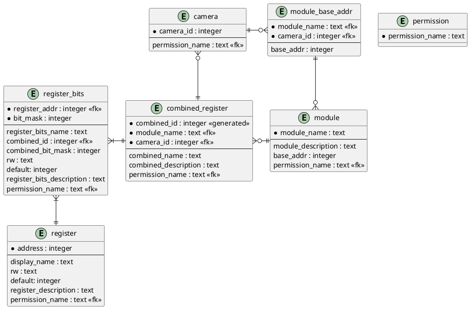

### 数据库ER图


### 数据库表结构
```sql
CREATE TABLE permission (
    permission_name TEXT PRIMARY KEY
);
CREATE TABLE register (
    address INTEGER PRIMARY KEY,
    display_name TEXT NOT NULL,
    rw TEXT NOT NULL,
    defaultValue INTEGER NOT NULL DEFAULT 0,
    register_description TEXT NOT NULL,
    permission_name TEXT NOT NULL,
    FOREIGN KEY (permission_name) REFERENCES permission (permission_name)
);
CREATE TABLE module (
    module_name TEXT PRIMARY KEY,
    module_description TEXT NOT NULL,
    permission_name TEXT NOT NULL,
    FOREIGN KEY (permission_name) REFERENCES permission (permission_name)
);
CREATE TABLE module_base_addr (
    module_name TEXT,
    camera_id INTEGER,
    base_addr INTEGER NOT NULL,
    PRIMARY KEY (module_name, camera_id),
    FOREIGN KEY (module_name) REFERENCES module (module_name),
    FOREIGN KEY (camera_id) REFERENCES camera (camera_id)
);
CREATE TABLE camera (
    camera_id INTEGER PRIMARY KEY,
    permission_name TEXT NOT NULL,
    FOREIGN KEY (permission_name) REFERENCES permission (permission_name)
);
CREATE TABLE combined_register (
    combined_id INTEGER PRIMARY KEY AUTOINCREMENT,
    module_name TEXT,
    camera_id INTEGER,
    combined_name TEXT,
    display_name TEXT,
    combined_description TEXT,
    permission_name TEXT,
    FOREIGN KEY (module_name) REFERENCES module (module_name),
    FOREIGN KEY (camera_id) REFERENCES camera (camera_id),
    FOREIGN KEY (permission_name) REFERENCES permission (permission_name)
);
CREATE TABLE register_bits (
    register_addr INTEGER,
    bit_mask INTEGER,
    register_bits_name TEXT,
    combined_id INTEGER,
    combined_bit_mask INTEGER,
    rw TEXT,
    default INTEGER,
    register_bits_description TEXT,
    permission_name TEXT,
    FOREIGN KEY (register_addr) REFERENCES register (address),
    FOREIGN KEY (combined_id) REFERENCES combined_register (combined_id),
    FOREIGN KEY (permission_name) REFERENCES permission (permission_name)
);
```

### 数据库表数据示例
<!-- module_id,module_name,camera,base_addr,address,RW,bits,bit_mask,default_all,description,unique_name,origin_name,combine_name,target_bit_mask,RW,origin_bit_mask,default
CAECStatistic_V60_V,CAECStatistic_V60_V,,0x00005000,0x00005000,RO,8,0xFF,0x00,,CAECStatistic_V60_V_s_hist_0[7:0],s_hist_0[7:0],s_hist_0,0x000000FF,RO,0xFF,0x00
cam0_AEC,AEC,0,0x00000BE0,0x00000D3A,RW,8,0xFF,0x28,0~16383,cam0_AEC_r_nDGainMax[7:0],r_nDGainMax[7:0],r_nDGainMax,0x000000FF,RW,0xFF,0x28
cam0_AEC,AEC,0,0x00000BE0,0x00000D3B,RW,8,0xFF,0x00,,cam0_AEC_r_nDGainMax[15:8],r_nDGainMax[15:8],r_nDGainMax,0x0000FF00,RW,0xFF,0x00
cam1_AEC,AEC,1,0x00001FE0,0x0000213A,RW,8,0xFF,0x28,0~16383,cam1_AEC_r_nDGainMax[7:0],r_nDGainMax[7:0],r_nDGainMax,0x000000FF,RW,0xFF,0x28
cam1_AEC,AEC,1,0x00001FE0,0x0000213B,RW,8,0xFF,0x00,,cam1_AEC_r_nDGainMax[15:8],r_nDGainMax[15:8],r_nDGainMax,0x0000FF00,RW,0xFF,0x00
CYUVDNS_V60_HW,CYUVDNS_V60_HW,,0x00005100,0x00005100,RW,8,0xFF,0x87,,CYUVDNS_V60_HW_r_dpc_en,r_dpc_en,r_dpc_en,0x00000000,RW,0x01,0x01
CYUVDNS_V60_HW,CYUVDNS_V60_HW,,0x00005100,0x00005100,RW,8,0xFF,0x87,,CYUVDNS_V60_HW_r_dns_en,r_dns_en,r_dns_en,0x00000000,RW,0x02,0x02
 -->
* permission  

| permission_name |
| --------------- |
| Develop         |
| A               |
| B               |
| C               |

详细描述如下：

| 键              | 含义     | 取值                            |
| --------------- | -------- | ------------------------------- |
| permission_name | 权限种类 | Administrator（管理员级别权限） |


* register

| address    | display_name      | rw  | default | register_description | permission_name |
| ---------- | ----------------- | --- | ------- | -------------------- | --------------- |
| 0x00005000 | s_hist_0[7:0]     | RO  | 0xFF    |                      | Develop         |
| 0x00000D3A | r_nDGainMax[7:0]  | RW  | 0x28    | 0~16383              | Develop         |
| 0x00000D3B | r_nDGainMax[15:8] | RW  | 0x00    |                      | Develop         |
| 0x0000213A | r_nDGainMax[7:0]  | RW  | 0x28    | 0~16383              | Develop         |
| 0x0000213B | r_nDGainMax[15:8] | RW  | 0x00    |                      | Develop         |
| 0x00005100 | xxxxxxxx          | RW  | 0x87    |                      | Develop         |

详细描述如下：

| 键                   | 含义                                           | 取值                       |
| -------------------- | ---------------------------------------------- | -------------------------- |
| address              | 寄存器地址（主键）                             | 32bit整型                  |
| display_name         |                                                | string                     |
| rw                   | 可读/写                                        | 'RW'（读写）、'RO'（只读） |
| default_value        | 默认值                                         | 0-255                      |
| register_description | 寄存器描述，一般存放取值范围等（没有限制功能） | string                     |
| permission_name      | 权限（外键，引用自表permission）               | 'Administrator'            |


* module

| module_name         | module_description | permission_name |
| ------------------- | ------------------ | --------------- |
| CAECStatistic_V60_V |                    | Develop         |
| AEC                 |                    | Develop         |
| CYUVDNS_V60_HW      |                    | Develop         |

详细描述如下：

| 键                 | 含义                             | 取值            |
| ------------------ | -------------------------------- | --------------- |
| module_name        | 模块名称，由CSV决定（主键）      | string          |
| module_description | 模块描述                         | string          |
| permission_name    | 权限（外键，引用自表permission） | 'Administrator' |


* module_base_addr

| module_name         | camera_id | base_addr  |
| ------------------- | --------- | ---------- |
| CAECStatistic_V60_V | NULL      | 0x00005000 |
| AEC                 | 0         | 0x00000BE0 |
| AEC                 | 1         | 0x00001FE0 |
| CYUVDNS_V60_HW      | NULL      | 0x00005100 |

详细描述如下：

| 键          | 含义                                                  | 取值      |
| ----------- | ----------------------------------------------------- | --------- |
| module_name | 模块名称，由CSV决定（外键，引用自表module，组合主键） | string    |
| camera_id   | 相机ID（外键，引用自表camera，组合主键）              | 0-1       |
| base_addr   | 该模块的基地址，存放该模块的寄存器的集合              | 32bit整型 |


* camera

| camera_id | permission_name |
| --------- | --------------- |
| 0         | Develop         |
| 1         | Develop         |

详细描述如下：

| 键              | 含义                             | 取值            |
| --------------- | -------------------------------- | --------------- |
| camera_id       | 相机ID（主键）                   | 0-1             |
| permission_name | 权限（外键，引用自表permission） | 'Administrator' |


* combined_register

| combined_id | module_name         | camera_id | combined_name | combined_description      | permission_name |
| ----------- | ------------------- | --------- | ------------- | ------------------------- | --------------- |
| 0           | CAECStatistic_V60_V | NULL      | s_hist_0      | Single register           | Develop         |
| 1           | AEC                 | 0         | r_nDGainMax   | Combined by two registers | Develop         |
| 2           | AEC                 | 1         | r_nDGainMax   | Combined by two registers | Develop         |
| 3           | CYUVDNS_V60_HW      | NULL      | r_dpc_en      | Split register            | Develop         |
| 4           | CYUVDNS_V60_HW      | NULL      | r_dns_en      | Split register            | Develop         |

详细描述如下：

| 键                   | 含义                                        | 取值            |
| -------------------- | ------------------------------------------- | --------------- |
| combined_id          | 组合寄存器ID（主键，自增）                  | 非负整型        |
| module_name          | 模块名称，由CSV决定（外键，引用自表module） | string          |
| camera_id            | 相机ID（外键，引用自表camera）              | 0-1             |
| combined_name        | 寄存器名，用于定位combined_id               | string          |
| display_name         | 寄存器的含义                                | string          |
| combined_description | 描述                                        | string          |
| permission_name      | 权限（外键，引用自表permission）            | 'Administrator' |


* register_bit_info

| register_addr | register_bits_name                | bit_mask | combined_id | combined_bit_mask | rw  | default | register_bits_description | permission_name |
| ------------- | --------------------------------- | -------- | ----------- | ----------------- | --- | ------- | ------------------------- | --------------- |
| 0x00005000    | CAECStatistic_V60_V_s_hist_0[7:0] | 0xFF     | 0           | 0x000000FF        | RO  | 0xFF    |                           | Develop         |
| 0x00000D3A    | cam0_AEC_r_nDGainMax[7:0]         | 0xFF     | 1           | 0x000000FF        | RW  | 0x28    | 0~16383                   | Develop         |
| 0x00000D3B    | cam0_AEC_r_nDGainMax[15:8]        | 0xFF     | 1           | 0x0000FF00        | RW  | 0x00    |                           | Develop         |
| 0x0000213A    | cam1_AEC_r_nDGainMax[7:0]         | 0xFF     | 2           | 0x000000FF        | RW  | 0x28    | 0~16383                   | Develop         |
| 0x0000213B    | cam1_AEC_r_nDGainMax[15:8]        | 0xFF     | 2           | 0x0000FF00        | RW  | 0x00    |                           | Develop         |
| 0x00005100    | CYUVDNS_V60_HW_r_dpc_en           | 0x01     | 3           | 0x00000000        | RW  | 0x01    |                           | Develop         |
| 0x00005100    | CYUVDNS_V60_HW_r_dns_en           | 0x02     | 4           | 0x00000000        | RW  | 0x02    |                           | Develop         |

详细描述如下：

| 键                       | 含义                                           | 取值                       |
| ------------------------ | ---------------------------------------------- | -------------------------- |
| register_addr            | 寄存器地址（组合主键）                         | 32bit整型                  |
| bit_mask                 | 寄存器有效位（组合主键）                       | 8bit整型                   |
| register_bits_name       | 寄存器位名称                                   | string                     |
| combined_id              | 组合寄存器ID                                   | 整型                       |
| combined_bit_mask        | 寄存器有效位在组合寄存器的位信息，用于拼接     | 整型                       |
| rw                       | 可读/写                                        | 'RW'（读写）、'RO'（只读） |
| default_value            | 默认值                                         | 0-255                      |
| register_bit_description | 寄存器描述，一般存放取值范围等（没有限制功能） | string                     |
| permission_name          | 权限（外键，引用自表permission）               | 'Administrator'            |


* awb_calibration_register

| awb_register_name | module_name      | combined_name      |
| ----------------- | ---------------- | ------------------ |
| 0                 | AWB_STATIS_V60_A | r_nor_tab_bor[0]   |
| 1                 | AWB_STATIS_V60_A | r_nor_tab_bor[1]   |
| 2                 | AWB_STATIS_V60_A | r_div_norm_step[0] |
| 3                 | AWB_STATIS_V60_A | r_div_norm_step[1] |

详细描述如下：

| 键                | 含义              | 取值   |
| ----------------- | ----------------- | ------ |
| awb_register_name | AWB寄存器（主键） | 整型   |
| module_name       | 模块名称          | string |
| combined_name     | 组合寄存器名      | string |


- ui_module

| module_name | permission_name |
| ----------- | --------------- |
| ImgFmt      | Administrator   |
| AEC         | Administrator   |

详细描述如下：

| 键              | 含义                                  | 取值            |
| --------------- | ------------------------------------- | --------------- |
| module_name     | 模块名称（主键，由界面决定，不是CSV） | string          |
| permission_name | 权限（外键，引用自表permission）      | 'Administrator' |


- ui_info

| module_name | control_name | control_index | combined_name          | register_address | permission_name |
| ----------- | ------------ | ------------- | ---------------------- | ---------------- | --------------- |
| AEC         | BandEnable L | 0             | r_pBandEnable[0]       | NULL             | Administrator   |
| AEC         | BandEnable M | 0             | r_pBandEnable[1]       | NULL             | Administrator   |
| AEC         | OneBandLim L | 0             | r_pOneBandLimEnable[0] | NULL             | Administrator   |
| AEC         | OneBandLim M | 0             | r_pOneBandLimEnable[1] | NULL             | Administrator   |
| AEC         | Enable       | 0             | r_bGradedExpoLimEn     | NULL             | Administrator   |

详细描述如下：

| 键               | 含义                             | 取值            |
| ---------------- | -------------------------------- | --------------- |
| module_name      | 模块名称（组合主键）             | string          |
| control_name     | 控件名称（组合主键）             | string          |
| control_index    | 控件索引（组合主键）             | 整型            |
| combined_name    | 寄存器名，用于定位combined_id    | string          |
| register_address | 寄存器地址                       |                 |
| permission_name  | 权限（外键，引用自表permission） | 'Administrator' |


- ui_info_regmodule

| ui_module_name | ui_control_name | reg_module_name | has_camera_id |
| -------------- | --------------- | --------------- | ------------- |
| AEC            | BandEnable L    | AEC             | 1             |
| AEC            | BandEnable M    | AEC             | 1             |
| AEC            | OneBandLim L    | AEC             | 1             |
| AEC            | OneBandLim M    | AEC             | 1             |

详细描述如下：

| 键              | 含义                                   | 取值   |
| --------------- | -------------------------------------- | ------ |
| module_name     | 模块名称                               | string |
| control_name    | 控件名称                               | string |
| reg_module_name | 寄存器模块名称（外键，引用自表module） | string |
| has_camera_id   | 是否存在camera id                      | 0-1    |


### ORM接口

```c++
class Permission {
public:
    static vector<Permission> getAllPermissions();
};

class Register {
public:
    int getAddress();
    string getRegisterName();
    string getDisplayName();
    string getRW();
    int getDefault();
    string getRegisterDescription();
    string getPermissionName();
    vector<RegisterBits> getRegisterBits();
    static vector<Register> getAllRegisters();
    static Register getRegisterByAddress(int address);
    static vector<Register> getRegistersByCameraId(int cameraId);
    static vector<Register> getRegistersByModuleName(string moduleName);
    static vector<Register> getRegistersByModuleNameAndCameraId(string moduleName, int cameraId);
private:
    int address;
    string registerName;
    string displayName;
    string rw;
    int default;
    string registerDescription;
    string permissionName;
};

class Module {
public:
    string getModuleName();
    string getModuleDescription();
    string getPermissionName();
    vector<int> getBaseAddr();
    int getBaseAddrByCameraId(int cameraId);
    vector<Register> getRegisters();
    vector<Register> getRegistersByCameraId(int cameraId);
    vector<CombinedRegister> getCombinedRegisters();
    vector<CombinedRegister> getCombinedRegistersByCameraId(int cameraId);
    vector<RegisterBits> getRegisterBits();
    vector<RegisterBits> getRegisterBitsByCameraId(int cameraId);
    static Module getModuleByModuleName(string moduleName);
private:
    string moduleName;
    string moduleDescription;
    string permissionName;
};

class CombinedRegister {
public:
    int getCombinedId();
    string getModuleName();
    int getCameraId();
    string getCombinedName();
    string getCombinedDescription();
    string getPermissionName();
    vector<RegisterBits> getRegisterBits();
    vector<Register> getRegisters();
    Module getModule();
    static CombinedRegister getCombinedRegisterByCombinedId(int combinedId);
    static CombinedRegister getCombinedRegisterByModuleNameAndCameraIdAndCombinedName(string moduleName, int cameraId, string combinedName);
    static vector<CombinedRegister> getCombinedRegistersByModuleName(string moduleName);
    static vector<CombinedRegister> getCombinedRegistersByCameraId(int cameraId);
    static vector<CombinedRegister> getCombinedRegistersByModuleNameAndCameraId(string moduleName, int cameraId);
private:
    int combinedId;
    string moduleName;
    int cameraId;
    string combinedName;
    string combinedDescription;
    string permissionName;
};

class RegisterBits {
public:
    int getRegisterAddr();
    int getBitMask();
    string getRegisterBitsName();
    int getCombinedId();
    int getCombinedBitMask();
    string getRW();
    int getDefault();
    string getRegisterBitsDescription();
    string getPermissionName();
    Register getRegister();
    CombinedRegister getCombinedRegister();
    static RegisterBits getRegisterBitsByRegisterBitsName(string registerBitsName);
    static vector<RegisterBits> getRegisterBitsByRegisterAddr(int registerAddr);
    static vector<RegisterBits> getRegisterBitsByCombinedId(int combinedId);
    static RegisterBits getRegisterBitsByRegisterAddrAndBitMask(int registerAddr, int bitMask);
private:
    int registerAddr;
    int bitMask;
    string registerBitsName;
    int combinedId;
    int combinedBitMask;
    string rw;
    int default;
    string registerBitsDescription;
    string permissionName;
};
```

```