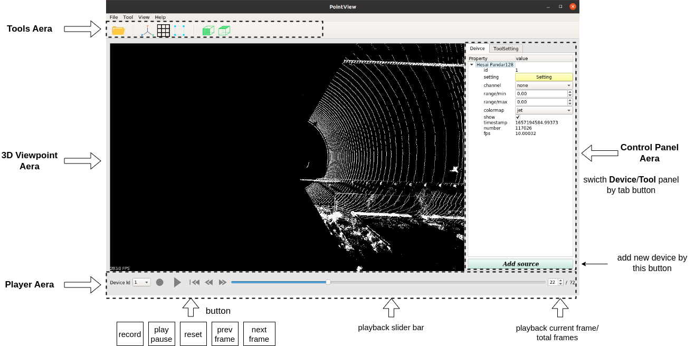
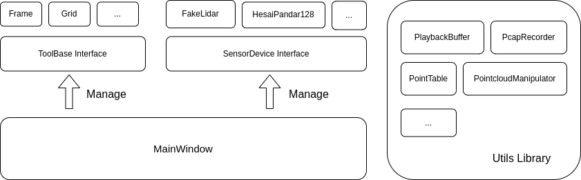

# PointView

The `PointView `is a general 3D point cloud visualization software for Lidar/Radar based on `PCL` and `Qt`.

## Build from source code

Prerequisites

* OS: ubuntu20.04
* Docker-CE version 19.03 and above ([docker doc](https://docs.docker.com/engine/install/ubuntu/))

Prepare docker environment

```bash
# download source code
git clone https://code.autox.ds/sensor/pointview.git
# pull docker image and create docker container
cd pointview
./docker/dev_start.sh
# activate docker env, then you can execute shell in docker env
./docker/dev_into.sh
```

build and launch`PointView` Application (in docker env)

```bash
# build 
./scripts/build.sh
# run
./scripts/run.sh
```

## Quick Start

when you launch `PointView` application, you can see GUI window like this, but without device data and point cloud data.



Steps to visualize point cloud:

* add new device by button  `Add source`, then select device you want to use.
* configure device in `device setting window` (Open `device setting window` by button `Setting`  in `Control Panel Aera`
  if you have closed it).
* play by `play` button in `Player Aera`.

## Files Structure

```
├── build/
├── doc/
├── config/
├── docker/
├── resource/
├── scripts/
├── src
│   ├── utils/
│   ├── tools/
│   ├── devices
│   │   ├── fakelidar
│   │   ├── hesai_pandar128
│   │   └── xlidar
│   ├── mainwindow.cpp
│   ├── mainwindow.h
│   ├── mainwindow.ui
│   └── main.cpp
├── CMakeLists.txt
├── pointview.pro
└── README.md
```

## Software Architecture




