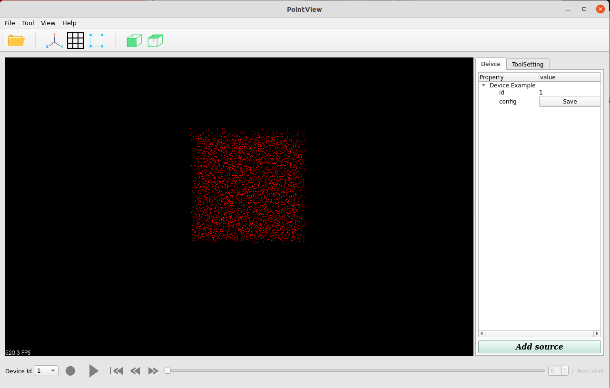

# DeviceBase

DeviceBase is a base class for all device. It inherits from `QObject` and has  `Q_OBJECT` macro so that DeviceBase can
define signals and slots.
To define a custom device class, you need inherit from this class.

This tutorial will use a device sample called `DeviceExample` to illustrate how to custom a device and use it
in `PointView`.

First of all, let's introduce to DeviceBase. The initialization function of DeviceBase is as follows:

```c++
explicit DeviceBase(std::shared_ptr<DisplayContext> context, int device_id,
                      const std::string& device_name);
```

`context` is a smart pointer of `DisplayContext`, which is used to connect device and point cloud visualizer.
In `DeviceBae`, it will wrap the `DisplayContext` and other properties to `DeviceContext`.
`device_id` was the unique device id in `PointView`.
`device_name` was the name show in property tree.
`DeviceBase` has several properties:

```c++
// unique device id
int device_id_;
// device context
std::shared_ptr<DeviceContext> device_context_;
// visualizer ptr
pcl::visualization::PCLVisualizer::Ptr viewer_;
// common items
std::shared_ptr<QLabel> device_id_label_;
std::shared_ptr<QPushButton> save_button_;
// play state
PlayerState player_state_;
```

The engine will provide the parameter `context` and `device_id`, so you just need to custom `device_name` and pass last
two parameter to base class.
There are several virtual functions which you need to implement.

```c++
// point cloud interfaces
bool updateUI();
// player interfaces
bool startPlayer();
bool pausePlayer();
bool startRecorder();
bool stopRecorder();
void setPlaybackFrameIdx(int index);
// config
bool InitFromConfig(std::shared_ptr<Config> config);
bool StoreToConfig(std::shared_ptr<Config> config);
```

Here is the definition of `DeviceExample`. Create device_base directory under devices. Copy that in `device_example.h`.

```c++
#ifndef SENSOREXAMPLE_H
#define SENSOREXAMPLE_H

#include "utils/common/device_base.h"

class DeviceExample : public autox::pointview::DeviceBase {
  Q_OBJECT
 public:
  // init function
  DeviceExample(std::shared_ptr<autox::pointview::DisplayContext> context,
                int device_id);
  // deleter
  ~DeviceExample() override;
  // return the flag if the engine need update
  bool updateUI() override;

 private:
  // point cloud
  PointCloudT::Ptr cloud_;
};

#endif  // SENSOREXAMPLE_H
```

Then, we implement it in `device_example.cpp`.

```c++
#include "device_example.h"

DeviceExample::DeviceExample(
    std::shared_ptr<autox::pointview::DisplayContext> context, int device_id)
    : autox::pointview::DeviceBase(context, device_id, "Device Example"),
      cloud_(new PointCloudT) {
  // add point cloud to pcl viewer
  viewer_->addPointCloud(cloud_, std::to_string(device_id_));
}

DeviceExample::~DeviceExample() {
  // remove point cloud from pcl viewer
  viewer_->removePointCloud(std::to_string(device_id_));
}

bool DeviceExample::updateUI() {
  // generate random cloud
  cloud_->resize(10000);
  for (int i = 0; i < cloud_->points.size(); ++i) {
    // random position
    cloud_->points[i].x = ((float)rand() / RAND_MAX) * 100;
    cloud_->points[i].y = ((float)rand() / RAND_MAX) * 100;
    cloud_->points[i].z = ((float)rand() / RAND_MAX) * 100;
    // set red color
    cloud_->points[i].r = 255;
    cloud_->points[i].g = 0;
    cloud_->points[i].b = 0;
  }
  // update point cloud
  viewer_->updateUI(cloud_, std::to_string(device_id_));
  // true to call engine to update viewer
  return true;
}

```

Finally, you need register this device in device factory. Add this line in `device_factory.cpp`. Do not forget to
include `device_example.h`.

```c++
registerDevice<DeviceExample>("DeviceExample");
```

## Compiling and running the program

Create a `CMakeLists.txt` file with the following contents:

```cmake
add_library(device_example SHARED
        device_example.cpp
        )
target_link_libraries(device_example ${PCL_LIBRARIES} ${QTX}::Widgets utils)
```

Then add subdirectory in device `CMakeLists.txt`:

```cmake
add_subdirectory(device_example)
```

Finally, add shared library in top level `CMakeLists.txt`:

```cmake
add_subdirectory(device_example)
target_link_libraries(${PROJECT_NAME}
        ${PCL_LIBRARIES}
        ${QTX}::Widgets
        utils
        tools
        fakelidar
        hesai_pandar128
        xlidar
        # add your device
        device_example
        )
```

You can test the code after building.

