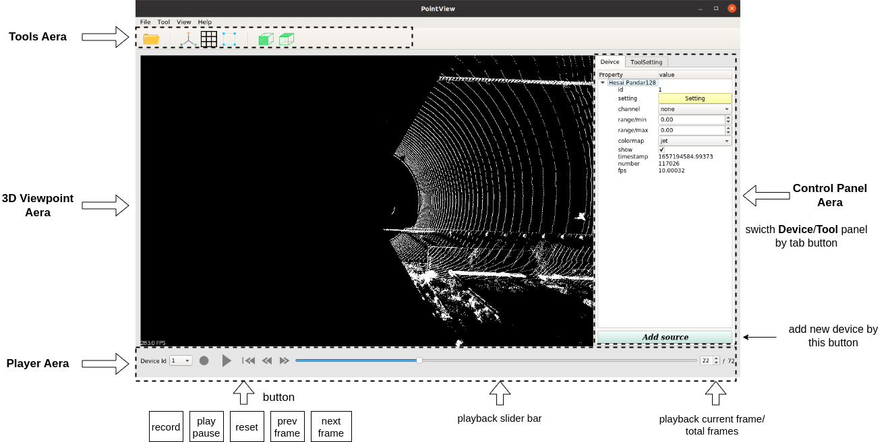
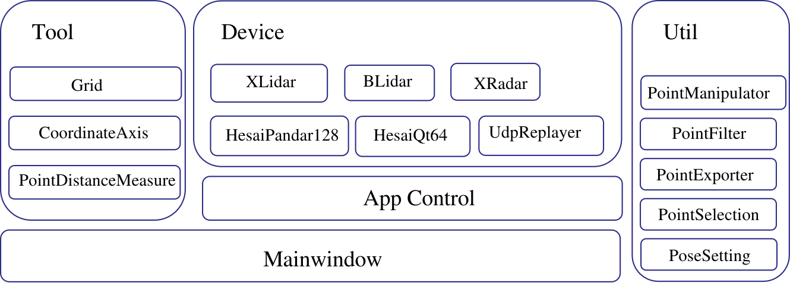

# PointView设计文档

## 1.需求背景

点云的可视化对于Lidar/Radar的开发具有重要的作用，可以快速看到lidar的工作效果，对于硬件传感器开发人员来说，可以用于评估lidar的数据质量以及故障排查，便于传感器开发的改进。对于Hesai，Aeva等Lidar厂商均具有配套的专有点云可视化工具，随着自研xLidar的硬件开发已经进入后期，需要一款点云可视化工具可以被硬件，嵌入式，测试等开发人员使用，对后续的硬件及软件改进具有重要价值。

目前的点云可视化可大致分为两类：

- 专用点云可视化应用：如主流的Lidar厂商（Hesai，Aeva等）会有一款传感器GUI应用。
- 通用点云可视化平台：如Rviz（ROS平台），Foxglove（Web平台，支持ROS/Custom bridge），xrt_visualizer（Xrt平台）等，不依赖传感器类型。

|              | **专用点云可视化应用**                                       | **通用点云可视化平台**                                       |
| ------------ | ------------------------------------------------------------ | ------------------------------------------------------------ |
| 优点         | 独立程序，不依赖平台。可以显示传感器相关信息，可以直接对传感器进行调试。 | 不依赖特定传感器，与传感器驱动解耦。功能强大，可以同时可视化多个不同的点云，还能可视化其他数据。 |
| 缺点         | 只支持特定传感器依赖传感器驱动，传感器驱动更新会要求软件的更新。 | 依赖平台（需要特定平台下运行，或者bridge插件）               |
| 主要应用场景 | Lidar传感器的开发测试：独立程序，上手简单。                  | 可以用于不同传感器的点云效果效果对比，可避免可视化软件的不同导致的主观结果差异性。可观察点云的特点，无需了解特定的传感器 |

在这个的需求背景下，希望pointview能够具有`专用点云可视化应用`可以直接调试传感器的特点，又具有`通用点云可视化平台`可以多设备多点云可视化的特点，目前的总结可能需求点如下：

- 可视化需求

  - 图形化界面，操作简单，易上手（针对于非软件人员）。
  - 基本的点云可视化功能，如支持3D交互视角观察。
  - 高级的点云可视化功能
    - 自定义颜色所表示的字段（intensity，velocity等）。
    - 自定义color map。
    - 三维点的框选，可显示点的详细信息。
    - 点云的过滤，根据设置的条件进行过滤。
  - 其他形式的数据可视化
    - Lidar的Range Image
    - Radar的Range Image

- 数据需求：支持不同的数据源

  - 支持在连接传感器的情况下，实时可视化Lidar等传感器的点云数据。
  - 支持录制实时数据。
  - 支持回放录制的数据。

- 设备调试需求

  - 显示设备的点云基本信息，如数据包数量，版本协议，回波模式等。
  - 显示设备的Log信息，与传感器的本地Log一致。
  - 设备的控制，以及参数配置。
  - 查看调试数据，如Lidar的ADC数据查看。
  - 其他具体调试功能。

- 多设备需求：

  - 多设备：虽然是专用点云可视化应用，但希望支持不同的设备。

    - 自研xLidar，bLidar，xRadar等传感器。
    - 在同一可视化平台上与其他厂商进行点云效果对比。

  - 同时可视化

    - 主Lidar+补盲Lidar同时可视化，需要设置点云的外参。

    - Lidar+Radar同时可视化，用于观察Radar的效果。

## 2.开发方案

调研了几款支持点云三维可视化的图形化界面软件（开源，有团队维护，有一定用户使用量）：

- **RViz**：rviz是ROS社区中官方可视化工具，支持图像，点云等多种数据可视化，目前是ROS项目中首选的点云可视化工具。
- **pcl_viewer**：PCL是一个应用广泛的c++点云功能库，pcl_viewer是其官方维护的可视化工具。
- **gz-gui**：Gazebo是Open Robotics的开源机器人三维仿真项目，其采用模块化开发，其中的gz_gui 模块可独立使用并可二次开发。

初次之外，还调研了一些多框架组合的点云可视化方案

- PCL viewer + QT：该方案PCL官方给了一个小Demo，https://pcl.readthedocs.io/projects/tutorials/en/latest/qt_visualizer.html#more-on-qt-and-pcl
  - 特点：使用QT开发UI面板，弥补了pcl viewer的缺陷，且pcl viewer对点云的操作较为便利。
- VTK + QT：该方案来源于感知组的内部工具开发，https://code.autox.ds/internal/mapping-experimental/-/merge_requests/9787
  - 特点：VTK是一个通用的图形可视化功能库，功能强大，但代码较为底层，学习成本大。

经过调研后，pointview的实现方案定定位为PCL viewer + QT，其优点如下：

* QT提供了一套成熟的GUI程序开发框架，可以快速开发出GUI程序，并且其开源，可免费使用。
* PCL是一个点云相关的C++库，其也提供了点云可视化的工具，并进行了封装，无需考虑3D渲染等细节实现，处理支持可视化点云，还支持线段，文字等其他数据在3D视窗中进行可视化。

## 3.软件设计

### 3.1 界面布局设计

整个的界面的布局参考了Rviz等软件的实现，UI界面如下（可能与最新版本的界面有所差异）：



整个软件一个包括四个区域：

* 工具栏区域：排布若干工具按钮，提供打开文件，进入框选模式，调整3D视图的视角等功能
* 3D视图区域：3D点云显示区域
* 播放条区域：选择播放控制的设备，在实时数据流模式下，支持播放暂停，在回放模式下，还可以以帧为单位进行跳转，跳转上一帧，下一帧。
* 控制区域：核心区域，可分成`Device`和`ToolSetting`两栏，`Device`显示所有设备的信息以及控制UI，可以对设备进行配置以及信息查看。`ToolSetting`显示所有工具的配置，如果网格大小，坐标系大小等。

3D视图区域可以动态调整大小，最大化可视化视图：

* 通过`QSplitter`可以动态调整3D视图区域与控制区域的边界，即可以完全隐藏控制区域。
* 隐藏工具栏区域（QT自带特性）。

### 3.2 数据框架设计

由于我们的软件有多设备点云可视化的需求，因此需要考虑设备的可扩展性，同时还需要支持网格，坐标轴等工具，因此也需要考虑工具类的可扩展性。从设备和工具的扩展性角度出发，我们抽象出两个基类：

* `DeviceBase` ：设备基类，所有设备都需要继承该基类，设备与设备之间独立，设备需要自己考虑点云的生成以及渲染，可以考虑每个设备单独一个线程。
* `ToolBase`：工具基类，所有工具都需要继承该基类，工具会进行3D视窗操作，或生成辅助3D数据。

除此之外，还需要考虑代码的复用性，做到高内聚，低耦合，因此需要抽象出设备类的通用功能，形成多个功能类，这样设备类可以复用多个功能类，提高开发效率。对于设备类的管理，可以考虑一个模块进行维护，综上程序的软件框架如下：



Mainwindow创建了GUI，并初始化了程序相关配置，完成Tool工具类以及Device设备类的创建以及初始化。由于设备较多，且设备的操作与更新相对复杂，因此这里使用一个单独的类`AppControl`进行设备管理，而工具类的管理直接在`MainWindow`中进行。对于Util功能类，是对设备功能的抽象，一个设备类可以包含多个不同的Util功能类。对应的层级关系如下：

```bash
MainWindow
├── Grid
├── CoordinateAxis
├── PointDistanceMeasure
├── AppControl
│   ├── XLidar
│   │   ├── PointManipulator
│   │   ├── PointSelection
│   │   ├── PointExporter
│   │   └── ...
│   ├── BLidar
│   │   ├── PointManipulator
│   │   ├── PointSelection
│   │   ├── PointExporter
│   │   └── ...
│   └── ...
└── ...
```

其中，AppControl的功能：

* 创建与销毁设备
* 轮询设备的UI更新
* 将点选信息传递给设备
* 绑定设备与player UI控件，以及更新对应的播放状态。

### 3.3 项目文件结构

```
├── build/                   # 编译目录
├── config/                  # 配置文件存放
├── doc/                     # 文档存放目录
├── docker/                  # 基于docker的开发环境配置相关文件
├── release/                 # 程序压缩包发布目录
├── resource/                # 资源文件目录，如图标
├── scripts/                 # 开发辅助脚本，如编译，调试，以及程序发布打包等脚本
├── src                      # 源代码目录
│   ├── utils/               # 基本公共类以及功能类代码目录
│   ├── tools/               # 工具类代码目录
│   ├── devices/             # 设备类代码目录
│   ├── app_control.cpp      # 设备管理类代码
│   ├── app_control.h
│   ├── device_factory.cpp   # 设备工厂类代码
│   ├── device_factory.h
│   ├── mainwindow.cpp       # GUI主窗口代码
│   ├── mainwindow.h
│   ├── mainwindow.ui
│   ├── qvtk_compatibility.h
│   └── main.cpp             # 程序入口main函数
├── pointview.pro
├── README.md
└── CMakeLists.txt           # 项目cmake配置
```

### 3.4 UI更新逻辑

由于QT的UI界面渲染和PCL的3D点云渲染都只能在UI线程中进行，但是每个设备一般采用独立的线程进行数据读取与解析，因此设备在进行点云渲染的时候不能直接调用渲染函数进行渲染，也不能直接进行UI更新，这里设计了一种轮询的方式进行UI更新。

`DeviceBase`的UI更新接口

```c++
virtual bool updateUI() { return false; };
```

对于新设备，需要重写该函数，将需要进行UI更新或渲染的逻辑代码放在该函数里，而`updateUI()`会被`AppControl`调用进行UI的更新，部分代码如下：

```c++
bool dirty = false;
for (size_t i = 0; i < device_list_.size(); i++) {
  auto& device = device_list_[i];
  auto flag = device->updateUI();
  dirty |= flag;
}
```

* 在`MainWindow`中，会创建一个定时器`QTimer`，以5ms的周期执行上述代码，实现了在UI线程中周期调用`updateUI() `，达到了UI更新的目的。

### 3.5 Context设计

在上面的数据类型框架中，存在很多不同的Tool工具类，Device设备类，Util功能类，使用context可以将他们更好的耦合起来，方便模块之间进行全局数据管理，在pointview中存在两个Context：

* `DisplayContext` ：维护QT控制区域UI与PCL 3D渲染UI数据，Device设备类和Tool工具类通过该`Context`进行UI的更新，是Device设备类和Tool工具类与UI之间的桥梁。
* `DeviceContext` ：维护设备的基本数据，Util功能类通过该`Context`进行设备数据的更新，是Device设备类与Util功能类之间桥梁。

`DisplayContext`核心数据结构

```c++
class DisplayContext {
  Viewer::Ptr viewer_ptr_;
  QTreeWidget* device_tree_;
  QTreeWidget* tool_tree_;
}
```

* `viewer_ptr_` : pcl中的3D渲染可视化工具类，3D视窗的所有操作均通过该类实现。
* `device_tree_`：控制区域UI中的设备类的树形UI父控件。
* `tool_tree_`：控制区域UI中的工具类的树形UI父控件。

`DeviceContext`核心数据结构

```c++
class DeviceContext {
  std::shared_ptr<DisplayContext> display_context_;
  // unique device id and device name
  int device_id_;
  std::string device_name_;
  // property_tree
  std::shared_ptr<PropertyTree> device_property_tree_;
  // point selection
  std::vector<PointSelectionCallback> point_selection_funcs_;
  // refresh state
  bool refresh_{false};
  // play state
  PlayerState player_state_;
  std::vector<TriggerCallback> start_player_funcs_;
  std::vector<TriggerCallback> pause_player_funcs_;
  std::vector<TriggerCallback> start_recorder_funcs_;
  std::vector<TriggerCallback> stop_recorder_funcs_;
}
```

* `display_context_`：DisplayContext，与UI操作相关。
* `device_id_`：设备唯一标识号，可避免命名冲突。
* `device_property_tree_`: 当前设备的树形UI父控件（可以创建子树）。
* `point_selection_funcs_`: 点选回调函数，当进入点选模式，框选点后，会回调该函数，并传入被选择到的点的index数组。
* `refresh_`: 点云更新标志位，比如切换点的color map等操作，会重新对点云进行颜色计算。
* `player_state_`：播放状态数据，可以获得当前播放状态，作为播放器状态机的状态，只能通过函数进行更新。
* `start_player_funcs_,pause_player_funcs_,start_recorder_funcs_,stop_recorder_funcs_`: 播放器UI按钮触发的对应回调，包括开始，暂停，开始录制，停止录制。

### 3.6 配置文件设计

在pointview中，会有一些状态数据，如3D视窗的当前视角等GUI的参数，也会有许多设备数据，如设备数据的udp端口，点云的外参设置等等，为了方便打开软件后可以快速恢复状态，这里可以使用配置文件的方式，保存程序的状态。参考ROS的参数管理的方式，使用一个类`Config`进行参数管理，配置文件采用yaml格式，其中读写参数的接口如下：

```c++
class Config {
 public:
  template <class T>
  bool getParameter(std::string name, T& value){...}  
  template <class T>
  bool setParameter(std::string name, const T& value){...}
}
```

为了方便参数的管理，这里参考ROS，参数命名支持namespace命名空间的方式，采用点`.`作为分隔符，命名空间的层级采用上述数据框架设计小节中的层级。

例如，Util功能类`PoseSetting`，采用命名空间`pose`，则`PoseSetting`中的平移参数`translation`对应的参数名为：

```bash
device_id.pose.translation
```

对应的yaml文件（部分）为:

```yaml
lidar_lists:
  1:
    device_type: xLidar256
    device_name: xLidar256
    pose:
      enable: false
      translation:
        - 0
        - 0
        - 0
```

