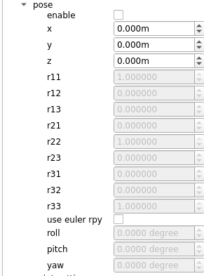

# 功能类开发指南

## 1.功能类工作模式

### 1.1 功能类分类

功能类是对设备功能的抽象，以实现功能代码的复用，提高设备类的开发效率，对于功能类的种类，可大致分为两类：

* 数据显示型功能类：在UI界面上显示必要的点云数据，如显示点云的数量以及时间戳等等。
  * 当前已经开发的功能类：`FrameInfo`，`LidarFrameInfo`，`PointExporter`，`PointSelection`，`UdpLogger`，`RangeImage`等

* 数据操作类型功能类：在UI界面输入相应的参数或者按钮，对点云数据进行操作，如点的过滤，根据设置条件的最大值最小值过滤掉部分点。
  * 当前已经开发的功能类：`PointFilter`，`PointManipulator`，`PoseSetting`等。

部分功能类可能同时兼顾了显示和操作，这里不做严格区分。

### 1.2 DeviceContext

Util功能类通过`DeviceContext` 进行设备数据的更新，是Device设备类与Util功能类之间桥梁，因此，需要了解`DeviceContext`提供的接口，其中功能类一般会用到的接口如下：

```c++
class DeviceContext {
 public:
  // viewer
  std::shared_ptr<DisplayContext> getDisplayContext();
  // refresh
  void refreshPointCloud();
  // point selction
  void registerPointSelectionCb(PointSelectionCallback func);
  // player fms
  void registerStartPlayerCb(TriggerCallback func);
  void registerPausePlayerCb(TriggerCallback func);
  void registerStartRecorderCb(TriggerCallback func);
  void registerStopRecorderCb(TriggerCallback func);
  // player interfaces
  bool updatePlayerState(PlayerCmd cmd);
  void updateCurrentFrame(int index);
  void updateTotalFrame(int n);
  void updatePlayerType(bool is_playback);
  void resetPlaybackJump();
  void resetPlaybackReload();
  PlayerState getPlayerState() { return player_state_; };
  // property
  std::shared_ptr<PropertyTree> getPropertyTree();
}
```

根据接口功能，大致可分为6类：

* 3D渲染：`getDisplayContext()`
  * 能够通过该接口进行3D渲染上的操作，目前仅`PointManipulator`用于设置点云中的点大小。
* 刷新点云：`refreshPointCloud()`
  * 当修改数据后，如修改了点云的colormap，需要重新渲染点云，只需要调用该函数即可。
* 注册点选操作回调：`registerPointSelectionCb()`
  * 这些回调用于选点后的操作，当进入点选模式时，框选点后会将点的index数组传递给点选回调，目前仅`PointSelection`使用。
  * 支持注册多个不同的回调。
* 注册播放操作回调：`registerStartPlayerCb()`,`registerStartPlayerCb()`,`registerStartRecorderCb()`,`registerStopRecorderCb()`
  * 这些回调为播放器UI按钮的回调，当点击UI界面上对应的按钮，会触发对应的回调。
  * 支持注册多个不同的回调。
* 播放状态机更新：`updatePlayerState()`, `updateCurrentFrame()`, `updateTotalFrame()`, `updatePlayerType()`, `resetPlaybackJump()`,`resetPlaybackReload()`,`getPlayerState()`
  * 均和播放有关系，内部维护了一个播放的状态机，通过这些接口，更新状态机的状态。
  * 其中`getPlayerState()`用的比较广泛，因为有些操作需要判断当前播放模式，以及有些功能只能暂停中使用。
  * 其他的接口目前主要在`SimplePlayerSetting`被调用。
* 获取属性UI树：
  * 用于创建子树，进而可创建功能类的属性UI。

## 2. 开发新的功能类

### 2.1 基本代码结构

通用型的功能类的代码均位于`src/utils`中，创建新的功能类只需要增加对应的源文件，并添加到`src/utils/CMakeLists.txt`中，如果该功能类是某一个设备专用的，则放在对应的设备目录下，如XRadar的功能类`XRadarSetting`放在`src/devices/xradar`目录下。

对于功能类，没有统一的接口基类，只有一个不成文的开发惯例，即构造函数必须传递`device_context`给功能类，这里以`PoseSetting`为例：

```c++
class PoseSetting : public QObject {
  Q_OBJECT

 public:
  PoseSetting(std::shared_ptr<DeviceContext> device_context);
  ~PoseSetting() = default;
  bool initFromConfig(std::shared_ptr<autox::pointview::Config> config);
  bool storeToConfig(std::shared_ptr<autox::pointview::Config> config);
  void transform(PointCloudT::Ptr cloud);
}
```

其中`initFromConfig()`和`storeToConfig()`用于加载pose参数和保存pose参数，`transform()`能够对点云进行坐标变换，实现点云的姿态设置。

### 2.2 创建UI界面

在功能类进行构造的时候就需要创建所需要的属性UI界面，实际上就是对属性树进行操作，这里以`PoseSetting`为例，其中部分UI创建代码为：

```c++
PoseSetting::PoseSetting(std::shared_ptr<DeviceContext> device_context)
    : QObject(device_context->getDisplayContext()->getParent()),
      device_context_(device_context) {
  auto sub = device_context_->getPropertyTree()->createPropertySubTree("pose");
  sub->setExpanded(false);
  // checkbox_enable_
  checkbox_enable_ = std::make_shared<QCheckBox>();
  connect(checkbox_enable_.get(), &QCheckBox::stateChanged, [this](int state) {
    enable_ = state > 0;
    updatePoseSetting();
  });
  sub->addProperty("enable", checkbox_enable_);
  // spinbox_translations_
  std::vector<QString> translation_names = {"x", "y", "z"};
  for (size_t i = 0; i < translation_names.size(); i++) {
    auto spinbox = std::make_shared<QDoubleSpinBox>();
    spinbox->setSingleStep(0.01);
    spinbox->setDecimals(3);
    spinbox->setRange(-1000, 1000);
    spinbox->setValue(0);
    spinbox->setSuffix("m");
    connect(spinbox.get(),
            static_cast<void (QDoubleSpinBox::*)(double)>(
                &QDoubleSpinBox::valueChanged),
            [this](double /*v*/) { updatePoseSetting(); });
    spinbox_translations_.push_back(spinbox);
    sub->addProperty(translation_names[i], spinbox);
  }
  //...
}
```

其中的过程大致可分为3步：

* 创建功能属性子树：使用`device_context_->getPropertyTree()->createPropertySubTree()`创建功能子树。
* 创建所需要的UI控件，并添加到子树中：使用`addProperty()`向属性树中添加控件。
* 连接控件的回调：使用`connect()`绑定控件UI的事件与回调操作。

生成的UI界面如下图所示：



### 2.3 数据更新

在`PoseSetting`的例子中，可以从UI界面中可以获取到点云的pose值，从而可以调用`PoseSetting`中`transform()`函数将点云变换到对应的pose，该函数的代码如下：

```c++
void PoseSetting::transform(PointCloudT::Ptr cloud) {
  if (!enable_) {
    return;
  }
  pcl::transformPointCloud(*cloud, *cloud, pose_);
}
```

由于该函数与点云渲染有关系，因此需要在UI线程中进行调用，因此需要在设备类的`updateUI()`调用该工具类的`transform()`函数，以`HesaiPandar128`为例，其部分代码如下：

```c++
bool HesaiPandar128::updateUI() {
  // ...
  // transform pointcloud
  pose_setting_->transform(pcl_pointcloud);
  // ...
}
```

