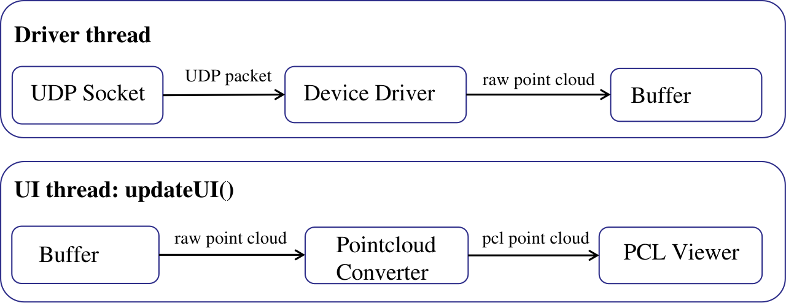
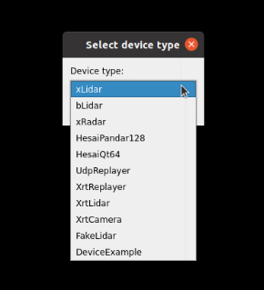

# 设备类开发指南

## 1.点云设备类工作模式

对于点云可视化，先考虑一个简单的例子，即对单个点云设备进行点云可视化，以Hesai Pandar128为例，其程序处理流程如下图所示：


* 创建udp socket，开始监听对应的UDP端口
* 使用循环读取udp数据包，并使用对应的驱动解析UDP包，得到原始点云结构体
* 将原始点云结构体转换成PCL格式的点云结构体
* 使用PCL Viewer添加该PCL格式的点云，并进行渲染。

但是，pointview涉及到多个设备，渲染部分只能在UI线程中进行，而数据解析一般采用独立的线程进行，这里可以采用生产者-消费者设计模式，实现数据在两个线程中进行异步处理，即Driver线程生产点云数据，而UI线程消耗点云数据，如下图所示：



其中的Buffer即为原始点云数据的队列，由于在多线程中进行共享，在使用的时候需要加锁。

## 2.开发新的设备类

### 2.1 设备类代码目录结构

对于新的设备类，需要在`src/devices`目录下面新建一个设备目录，这里以`hesai pandar128`为例，新建立的目录为`hesai_pandar128`，其目录结构如下：

```bash
├── CMakeLists.txt
├── hesai               # 驱动相关代码
│   ├── pandar128.cc
│   ├── pandar128.h
│   └── ...
├── hesai_pandar128.cpp # 设备类
└── hesai_pandar128.h
```

其中`hesai`目录中是设备驱动相关代码，由Hesai官方提供，`hesai_pandar128.cpp`中就是我们需要进行开发的设备类`HesaiPandar128`，在`CMakeLists.txt`会将该设备类编译成一个动态库，`CMakeLists.txt`的内容如下所示：

```cmake
add_library(hesai_pandar128 SHARED
    hesai_pandar128.cpp
    hesai/functional_safety.cc
    hesai/laser_ts.cc
    hesai/pandar128.cc
)
target_include_directories(hesai_pandar128 PRIVATE ${CMAKE_CURRENT_SOURCE_DIR})
target_link_libraries(hesai_pandar128 ${PCL_LIBRARIES} ${QTX}::Widgets utils)
```

* 最终生成一个`hesai_pandar128`的动态库

同时还需要修改`src/devices/CMakeLists.txt`，将该目录加入到过程中编译，只需要添加一行

```cmake
# hesai_pandar128
add_subdirectory(hesai_pandar128)
```

### 2.2 设备类构建

#### 2.2.1 继承DeviceBase基类

新的设备类需要继承`DeviceBase`，其中关键的成员变量是`device_context_`，包含设备最基本的数据结构，会被频繁使用到。这里依然以设备类`HesaiPandar128`为例，其核心代码声明如下：

```c++
class HesaiPandar128 : public autox::pointview::DeviceBase {
  Q_OBJECT

 public:
  HesaiPandar128(std::shared_ptr<autox::pointview::DisplayContext> context,
                 int device_id, const std::string& device_name);
  ~HesaiPandar128();
  bool updateUI() override;
  bool initFromConfig(
      std::shared_ptr<autox::pointview::Config> config) override;
  bool storeToConfig(std::shared_ptr<autox::pointview::Config> config) override;
}
```

其中覆写了`DeviceBase`的三个函数

* `updateUI()`：UI更新接口，会被UI线程周期性调用，任何UI操作都需要放在该函数内进行。
* `initFromConfig()` ：参数配置加载接口，如果pointview是从文件中加载配置，则在创建该设备类后，会将该设备相关的配置存在`config`中传递给设备进行初始化。
* `storeToConfig() `：参数配置保存接口，如果pointview需要保存配置到文件中，则需要设备类将当前配置存在`config`。

#### 2.2.2 生产点云buffer

在点云设备类工作模式中，使用了生产者消费者的设计模式，在Driver线程中，生产者的工作就是解析UDP数据包，并生成点云，涉及的相关成员变量如下：

```c++
class HesaiPandar128 : public autox::pointview::DeviceBase {
 private:
  std::shared_ptr<autox::pointview::SimplePlayerSetting> player_setting_;
  // driver
  std::shared_ptr<autox::drivers::hesai::Pandar128Driver> driver_;
  // for live streaming and playback
  std::shared_ptr<autox::pointview::UdpInput> udp_input_;
  std::shared_ptr<PlaybackBuffer> playback_buffer_;
  std::shared_ptr<autox::pointview::PcapUdpParser> pcap_parser_;
  // raw pointcloud buffer
  std::deque<std::shared_ptr<RawPointCloud>> raw_pointcloud_buffer_;
  std::mutex raw_pointcloud_buffer_mutex_;
}
```

* `player_setting_` : 播放功能类，包含UI逻辑，以及一个独立的数据处理线程，也就是Driver线程。
* `driver_`：驱动类，负责解析UDP包，并生成点云。
* `udp_input_`: 实时模式下，读取UDP包的封装。
* `pcap_parser_`: 回放模式下，解析pcap文件，读取UDP包的封装。
* `playback_buffer_`: 回放模式下，解析完UDP包后，会将所有帧的点云存放在该回放buffer中。
* `raw_pointcloud_buffer_`: 生产者-消费者涉及模式中的buffer。

对于这些功能类的初始化涉及到多个回调函数

```c++
void HesaiPandar128::initDriver() {
  // callback
  auto udp_cb = [this](const uint8_t* data, size_t len) {
    driver_->ParseLidarPacket(data, len);
  };
  auto point_cloud_cb = [this](std::shared_ptr<RawPointCloud>& point_cloud) {
    if (device_context_->getPlayerState().is_playback) {
      // for pcap playback
      auto new_point_cloud = std::make_shared<RawPointCloud>();
      *new_point_cloud = *point_cloud;
      playback_buffer_->addFrame(new_point_cloud->timestamp, new_point_cloud);
    } else {
      std::lock_guard<std::mutex> lock(raw_pointcloud_buffer_mutex_);
      // for live streaming
      raw_pointcloud_buffer_.push_back(point_cloud);
      if (raw_pointcloud_buffer_.size() > 2) {
        raw_pointcloud_buffer_.pop_front();
        std::cout << "[warning] rendering too long, drop raw point cloud!"
                  << std::endl;
      }
    }
  };
  // driver
  driver_ = std::make_shared<autox::drivers::hesai::Pandar128Driver>();
  driver_->setPointCloudCallback(point_cloud_cb);
  // for live streaming
  udp_input_ = std::make_shared<autox::pointview::UdpInput>(true);
  udp_input_->setMaxRecordPacket(3600 * 10 * 60 * 10);  // 10min
  udp_input_->setUdpCallback(udp_cb);
  // for pcap playback
  pcap_parser_ = std::make_shared<autox::pointview::PcapUdpParser>();
  pcap_parser_->setUdpCallback(udp_cb);
  playback_buffer_ = std::make_shared<PlaybackBuffer>();
  playback_buffer_->setFrameCallback(
      [this](std::shared_ptr<RawPointCloud> data, int idx, double /*t*/) {
        std::lock_guard<std::mutex> lock(raw_pointcloud_buffer_mutex_);
        if (raw_pointcloud_buffer_.size() < 2) {
          raw_pointcloud_buffer_.push_back(data);
          device_context_->updateCurrentFrame(idx);
        } else {
          std::cout << "[warning] rendering too long, drop raw point cloud!"
                    << std::endl;
        }
      });
}
```

由于需要考虑实时模式和回放模式，这里看起来会略显繁琐，但实际上两种模式不会同时存在，驱动的点云回调可以通过判断当前模式选择对应模式的处理，因此可得独立考虑这两种模式的处理逻辑：

* 实时模式：使用`udp_input_`读取UDP包，UDP回调会调用driver进行数据包解析，如果生产点云即放在`raw_pointcloud_buffer_`中。
* 回放模式：分为两个独立的过程
  * 解析pcap过程：使用`pcap_parser_`读取UDP包，UDP回调会调用driver进行数据包解析，如果生产点云即放在`playback_buffer_`中。
  * 播放过程：使用`playback_buffer_`中的缓存点云进行回放，其通过时间戳计算时间差，从而进行休眠实现回放效果，如果播放当前帧，则将当前点云放在`raw_pointcloud_buffer_`中。

在`player_setting_`中，创建了driver线程，支持实时模式和回放模式，只需要传入`udp_input_, pcap_parser_, playback_buffer_`即可。

```c++
player_setting_ = std::make_shared<autox::pointview::SimplePlayerSetting>(
      device_context_, udp_input_, pcap_parser_, playback_buffer_);
```

> 这里只考虑UDP数据的解析，对于其他驱动的通讯方式，如TCP等，暂时不在这里考虑。

#### 2.2.3 消费点云buffer

在点云设备类工作模式中，使用了生产者消费者的设计模式，易知，消费点云buffer应该在UI线程，即`UpdateUI()`中进行，

```c++
bool HesaiPandar128::updateUI() {
  {
    std::lock_guard<std::mutex> lock(raw_pointcloud_buffer_mutex_);
    if (!raw_pointcloud_buffer_.empty()) {
      current_frame_.raw_pointcloud = raw_pointcloud_buffer_.front();
      device_context_->refreshPointCloud();
      raw_pointcloud_buffer_.pop_front();
    }
  }
  if (!device_context_->getRefreshState()) {
    return false;
  }
  if (!current_frame_.raw_pointcloud) {
    return false;
  }
  auto start = std::chrono::steady_clock::now();
  auto& raw_pointcloud = current_frame_.raw_pointcloud;
  auto& pcl_pointcloud = current_frame_.pcl_pointcloud;
  // set info in frame
  current_frame_.timestamp = raw_pointcloud->timestamp;
  current_frame_.n_udp_packets = raw_pointcloud->udp_packet_number;
  current_frame_.n_points = raw_pointcloud->points.size();
  // convert raw_pointcloud to pcl_pointcloud
  pcl_pointcloud->resize(current_frame_.n_points);
  convertToPclPointCloud(current_frame_);
  // update point cloud
  // TODO(all) updatePointCloud will cause crash when the count of pointcloud
  // changed a lot, refer to https://github.com/PointCloudLibrary/pcl/pull/4017
  // (it's solved in pcl version1.11). another solution is using remove & add
  // instead of update pointcloud, it works well but not elegant. by the way,
  // for performace, remove & add API is faster than update API, which is
  // interesting.
  std::string cloud_id = std::to_string(device_context_->getDeviceId());
  // viewer_->updatePointCloud(pcl_pointcloud, cloud_id);
  viewer_->removePointCloud(cloud_id);
  viewer_->addPointCloud(pcl_pointcloud, cloud_id);
  // update flag
  device_context_->resetRefreshState();
  return true;
}
```

其中消费点云的部分可大致分为3个步骤：

* 检查`raw_pointcloud_buffer_`，等待新点云到来。
* 使用`convertToPclPointCloud` 将`raw_pointcloud`转换为`pcl_pointcloud`。
* 使用`viewer_`更新渲染的点云，以准备渲染。

#### 2.2.4 可扩展的可视化操作功能

上述内容实现了点云的基本可视化，但是为了支持更多高级的可视化操作，例如设置点的颜色大小，设置点云的姿态，框选并查看点的信息，根据条件进行点的过滤，保存点云等等，还需要创建并初始化其他功能类，例如，在`HesaiPandar128`中有这些功能类：

```c++
class HesaiPandar128 : public autox::pointview::DeviceBase {
 private:
  // helper utils
  std::shared_ptr<autox::pointview::LidarFrameInfo> info_;
  std::shared_ptr<autox::pointview::PoseSetting> pose_setting_;
  std::shared_ptr<autox::pointview::PointManipulator> manipulator_;
  std::shared_ptr<autox::pointview::SimplePlayerSetting> player_setting_;
  std::shared_ptr<autox::pointview::PointSelection> point_selection_;
  std::shared_ptr<autox::pointview::LaserTrack> laser_track_;
  std::shared_ptr<autox::pointview::LidarReturnInfo> return_mode_info_;
  std::shared_ptr<autox::pointview::RangeImage> range_image_;
  std::shared_ptr<autox::pointview::PointFilter> point_filter_;
  std::shared_ptr<autox::pointview::LidarIntrinsics> lidar_intrinsics_;
  std::shared_ptr<autox::pointview::PointExporter> point_exporter_;
}
```

### 2.3 加入到设备工厂类中

上述小节实现了设备类创建以及相应动态库的生成，为了能够在pointview使用该设备，还需要将该设备加入到设备工厂类`DeviceFactory`中，位于`src/device_factory.cpp`中，加入设备到工厂类的部分代码如下：

```c++
DeviceFactory::DeviceFactory() {
  registerDevice<XLidar>("xLidar");
  registerDevice<BLidar>("bLidar");
  registerDevice<XRadar>("xRadar");
  registerDevice<HesaiPandar128>("HesaiPandar128");
  registerDevice<HesaiQt64>("HesaiQt64");
  registerDevice<UdpReplayer>("UdpReplayer");
  registerDevice<XrtReplayer>("XrtReplayer");
  registerDevice<XrtLidar>("XrtLidar");
  registerDevice<XrtCamera>("XrtCamera");
  registerDevice<FakeLidar>("FakeLidar");
  registerDevice<DeviceExample>("DeviceExample");
}

```

对于新设备，只需要额外加一行`registerDevice<NewDevice>("NewDevice")`即可。

* 设备类的构造函数的参数必须为`(std::shared_ptr<autox::pointview::DisplayContext> context,int device_id, const std::string& device_name)`

除此之外，还需要链接设备类的动态库，修改`src/CMakeLists.txt`

```cmake
target_link_libraries(${PROJECT_NAME}
        ${PCL_LIBRARIES}
        ${QTX}::Widgets
        utils
        tools
        fakelidar
        hesai_pandar128
        hesai_qt64
        xlidar
        xradar
        blidar
        device_example
        udp_replayer
        xrt_replayer
        )
```

* 在`target_link_libraries`后面添加设备类的动态库名字

这样，在pointview中，选择设备的时候，就能选择新设备，如下图所示：


